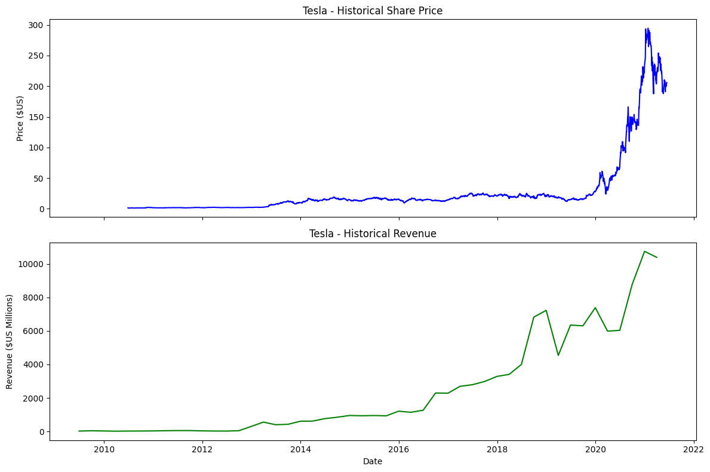
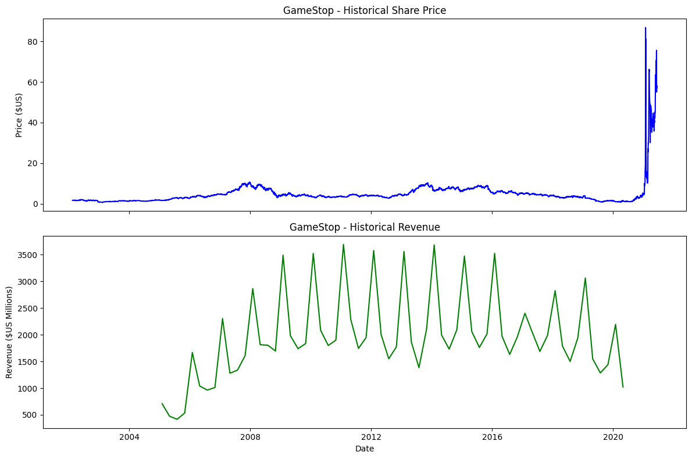

📊 # Revenue Dashboard Project

🔍 Overview

This project analyzes Tesla and GameStop stock data and revenue trends. It demonstrates data extraction using APIs and web scraping, data cleaning, and data visualization using Python.

This project is part of my Data Science portfolio showcasing real-world data analysis skills.

---

🎯 Objectives

- Extract stock data using "yfinance"
- Extract revenue data using web scraping
- Clean and process datasets
- Visualize stock prices and revenue trends
- Compare Tesla and GameStop performance

---

📊 Sample Outputs

Tesla Stock & Revenue

- Visualization of Tesla stock price over time
- Revenue trends showing company growth

GameStop Stock & Revenue

- Visualization of GameStop stock price
- Revenue trends showing volatility

 🎮 GameStop Analysis

---

🛠 Tools & Technologies

- Python
- Pandas
- yfinance
- BeautifulSoup (Web Scraping)
- Matplotlib / Plotly
- Jupyter Notebook

---

📈 Key Insights

- Tesla shows consistent long-term growth in both stock price and revenue.
- GameStop displays high volatility and irregular trends.
- Data visualization helps clearly compare performance between companies.

---

📁 Project Files

- "tesla-gme-stock-analysis.ipynb" → Main notebook with full analysis
- "README.md" → Project documentation

---

👤 Author

**Ruel Laranjo**  
Junior Data Scientist | Python | Data Analysis | Data Visualization

---

## Note
The dataset used in this project is based on the IBM Data Science Professional Certificate lab. 
Some visualizations (such as stock and revenue graphs) are limited to data up to mid-2021 due to the structure of the provided functions in the lab.

This project demonstrates data extraction, cleaning, and visualization techniques rather than real-time data analysis.
